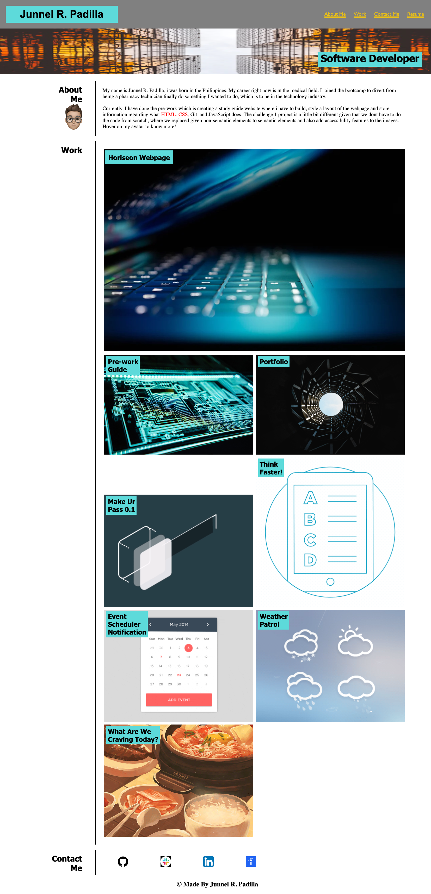

# Challenge2-Portfolio

## Description

In this project, we were ask to create a Personal portfolio highlighting our
projects we have done so far, how to connect with me and also little information
about me.

This website contains interactive content for easy navigation such as 
About Me, Work, Contact Me and also a link to download my personal Resume.
I also added additional interactive contact with my avatar, when click, it will
take you to my Instagram page. As for the my Work section, when hovered to it, the background will turn almost black with the text title in white and take you to the webpage when clicked. As for my contact me section, i replaced the words with
the logo to give my website more life, and if not familiar with certain logo, it can be hover over to see as to what website the icon belongs to.

## Usage

This personal webpage portfolio gives a little bit description of myself, showcases my previous projects and also have links on how to contact me.

## URL

https://junnel308.github.io/challenge2-portfolio/

## Screenshots

## Credits

Robert Wijtman (Instructor), AskBCS Learning Assistance, Bootcamp Modules, Minjoo Park

## License

MIT License

Copyright (c) 2022 JP Padilla

Permission is hereby granted, free of charge, to any person obtaining a copy
of this software and associated documentation files (the "Software"), to deal
in the Software without restriction, including without limitation the rights
to use, copy, modify, merge, publish, distribute, sublicense, and/or sell
copies of the Software, and to permit persons to whom the Software is
furnished to do so, subject to the following conditions:

The above copyright notice and this permission notice shall be included in all
copies or substantial portions of the Software.

THE SOFTWARE IS PROVIDED "AS IS", WITHOUT WARRANTY OF ANY KIND, EXPRESS OR
IMPLIED, INCLUDING BUT NOT LIMITED TO THE WARRANTIES OF MERCHANTABILITY,
FITNESS FOR A PARTICULAR PURPOSE AND NONINFRINGEMENT. IN NO EVENT SHALL THE
AUTHORS OR COPYRIGHT HOLDERS BE LIABLE FOR ANY CLAIM, DAMAGES OR OTHER
LIABILITY, WHETHER IN AN ACTION OF CONTRACT, TORT OR OTHERWISE, ARISING FROM,
OUT OF OR IN CONNECTION WITH THE SOFTWARE OR THE USE OR OTHER DEALINGS IN THE
SOFTWARE.